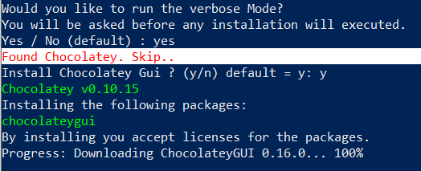

# Windows 10 automatic script setup
_Windows10.ps1_ : This script will automatically install programs and tweak your system. Very handy if you're in front of a freshly naked installed machine  
_checkUpdates.ps1_ : This script will check for available Windows updates and just lists them  
_installUpdates.ps1_ : This script will install available Windows updates. You get prompted for "Yes, Yes All, No, No All"  

## Included programs
- chocolatey
- chocolatey gui

## Included tweaks
WIP

## How to use it
### Prerequisites
- Run a powershell with adminitrator priviliges. 
To do so, type <kbd>Win</kbd> + <kbd>S</kbd>.
Then search for "powershell". Right click on the result 
and click on "Run as administrator" via the context menu
### Setup
- Navigate to the folder containing the script (cd .. etc)
- type 'Set-ExecutionPolicy Bypass' and hit Enter
You need to do this in order to run the script!
- type '.\windows10.ps1' and hit enter
- After completion, type 'Set-ExecutionPolicy Default'
### Running
The script will interactivly ask you if needed.

## Credits
TBA

---

> [jannesbrunner.de](https://www.jannesbrunner.de) &nbsp;&middot;&nbsp;
> GitHub [@jannesbrunner](https://github.com/jannesbrunner) &nbsp;&middot;&nbsp;
